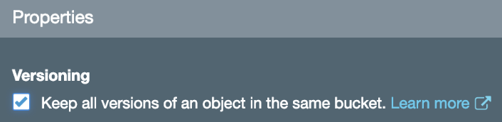

An s3 bucket has to be made in your aws account to hold [CloudFormation nested stacks](https://docs.aws.amazon.com/AWSCloudFormation/latest/UserGuide/using-cfn-nested-stacks.html). Nested stacks are reuseable, CloudFormation snippets. Nested stacks MUST be stored in s3.

1.  Create a new **versioned** S3 bucket to hold these nested stacks. We recommend naming it: `[region]--aws-blueprint.yourdomain.com/nested-stacks`. Ex: `us-east-1--aws-blueprint.yourdomain.com/nested-stacks`. You can enable versioning in the S3 web console by checking this box:
    
1.  Clone this repo
1.  `cd` to the `nested-stacks` dir and run: `aws s3 sync . s3://us-east-1--aws-blueprint.yourdomain.com/nested-stacks`

From time to time, nested stacks in this repo are updated. If you want to pull in these changes, they need be synced to your s3 aws-blueprint nested stacks bucket. Remember your bucket is **versioned**, and aws-blueprint references the stacks by the version - so you don't have to worry about breaking anything in the field.

### Note

You can validate your CloudFormation template from the CLI. Ex: `aws cloudformation validate-template --template-body file://apig/single-lambda-proxy-with-CORS.yaml`. If it passes the validator, but you get strange errors running CloudFormation, create the nested stack yaml directly in the cloudformation console. It gives better errors.
